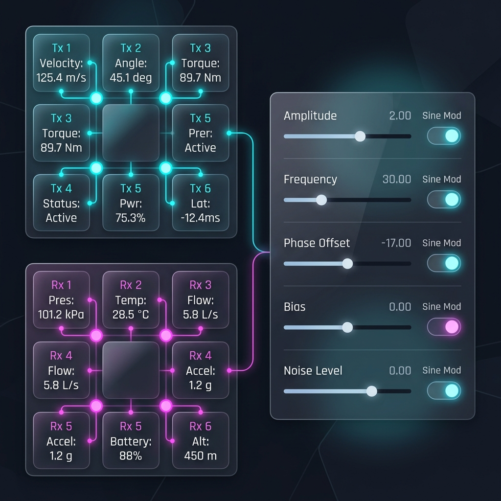

# Universal UDP Console

A high-performance, unified Node.js real-time simulation dashboard designed to simulate, monitor, and control signals for any LabVIEW UI utilizing a 6-channel double-precision UDP structure.



## Features
* **No Python Prerequisite**: The simulation loop runs directly within the Node.js backend.
* **Universal 6-Channel Layout**:
  * **Generic Tx Channels (1-6)**: Send data to LabVIEW on port `54400` as double-precision values.
  * **Generic Rx Channels (1-6)**: Receive feedback/commands from LabVIEW on port `25000` and displays them live in the web browser.
* **Granular Output Modification**:
  * **6 Output Sliders**: Adjust baseline values for outgoing channels from `-100` to `+100`.
  * **6 Sine Mod Toggles**: Enable a 1 Hz sine wave sweep on individual channels for dynamic telemetry sweeps.
* **Adjustable Sample Time**: Set the transmission interval from `2 ms` to `1000 ms` directly from the web page.
* **Byte Order / Endianness**: Configured for **Big-Endian** (`>`) format to match LabVIEW's default network configuration.

---

## Configuration & Ports

| Direction | Port | Data Type | Bytes | Description |
|---|---|---|---|---|
| **Send** (To LabVIEW) | `54400` | 6 × 64-bit Doubles (Big Endian) | 48 bytes | Outputs simulated state variables (`Tx 1` to `Tx 6`) |
| **Receive** (From LabVIEW) | `25000` | 6 × 64-bit Doubles (Big Endian) | 48 bytes | Listens for commands or feedback (`Rx 1` to `Rx 6`) |

---

## Getting Started

### 1. Prerequisites
Ensure you have **Node.js** installed on your system.

### 2. Start the Server
Open PowerShell in this directory and execute:
```powershell
npm start
```

### 3. Open the Dashboard
Navigate to **[http://localhost:3000](http://localhost:3000)** in your web browser.

---

## LabVIEW UI Setup Guide

1. **Receiving Data (UDP Read)**:
   * Open a UDP socket on port **`54400`**.
   * Use **UDP Read** with the `max size` input terminal set to at least **`48`** bytes.
   * Wire the string output of the UDP Read to the **Unflatten from String** block.
   * Configure the `type` terminal of the Unflatten block with an **Array of 6 DBLs (Double-Precision Floats)**.
   * Ensure **Byte Order** is set to network/Big-Endian.

2. **Sending Commands (UDP Write)**:
   * Configure a **UDP Write** block targeting `127.0.0.1` on port **`25000`**.
   * Flatten your control variables array/cluster (6 × DBL) to a string and send it to the server.
